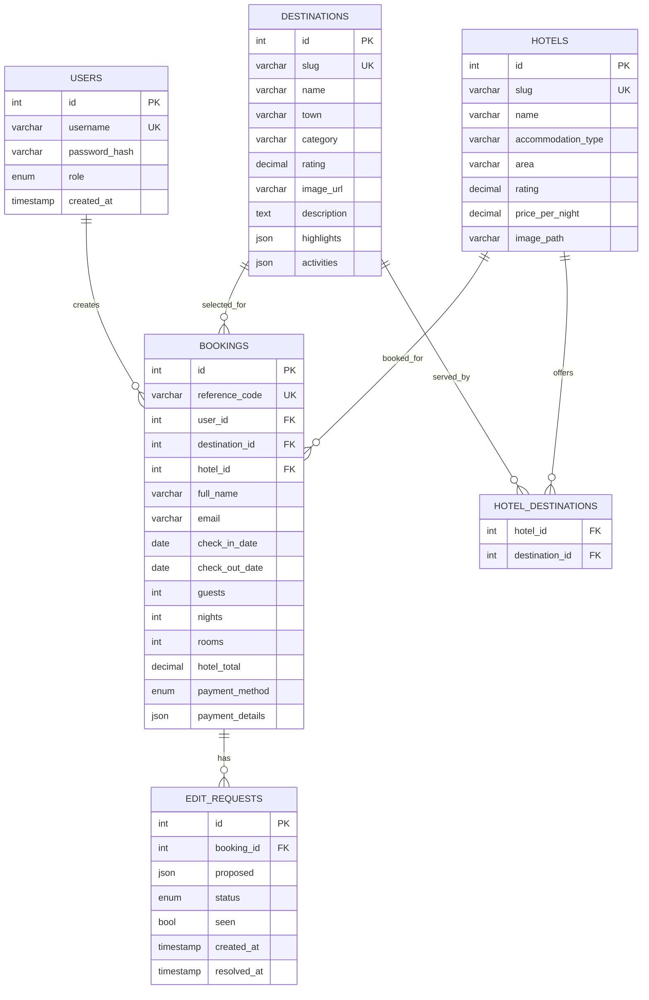

# ER Diagram

```mermaid
erDiagram
  USERS ||--o{ BOOKINGS : creates
  DESTINATIONS ||--o{ BOOKINGS : selected_for
  HOTELS ||--o{ BOOKINGS : booked_for
  HOTELS ||--o{ HOTEL_DESTINATIONS : offers
  DESTINATIONS ||--o{ HOTEL_DESTINATIONS : served_by
  BOOKINGS ||--o{ EDIT_REQUESTS : has

  USERS {
    int id PK
    varchar username UK
    varchar password_hash
    enum role
    timestamp created_at
  }

  DESTINATIONS {
    int id PK
    varchar slug UK
    varchar name
    varchar town
    varchar category
    decimal rating
    varchar image_url
    text description
    json highlights
    json activities
  }

  HOTELS {
    int id PK
    varchar slug UK
    varchar name
    varchar accommodation_type
    varchar area
    decimal rating
    decimal price_per_night
    varchar image_path
  }

  HOTEL_DESTINATIONS {
    int hotel_id FK
    int destination_id FK
  }

  BOOKINGS {
    int id PK
    varchar reference_code UK
    int user_id FK
    int destination_id FK
    int hotel_id FK
    varchar full_name
    varchar email
    date check_in_date
    date check_out_date
    int guests
    int nights
    int rooms
    decimal hotel_total
    enum payment_method
    json payment_details
  }

  EDIT_REQUESTS {
    int id PK
    int booking_id FK
    json proposed
    enum status
    bool seen
    timestamp created_at
    timestamp resolved_at
  }
```
